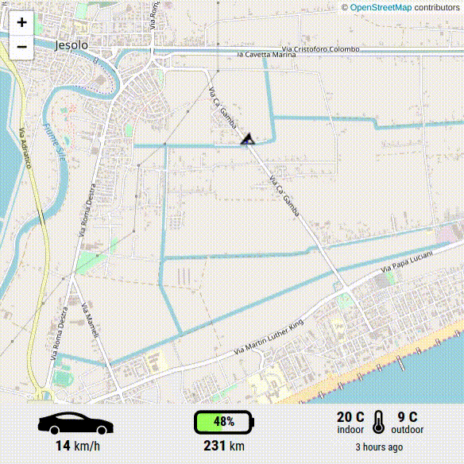

# TeslaTS
[](https://www.npmjs.org/package/teslats)
[](https://github.com/vekexasia/tesla-ts/blob/master/LICENSE)
[](https://david-dm.org/vekexasia/tesla-ts)

## Unofficial NodeJS library with Type definitions in TypeScript that wraps the unofficial Tesla APIs.

### Other good projects

If you dont one or more then the followings:
 * Promises
 * TypeScript definitions
 * Rx.js/like streams from tesla.

There is a very good and documented project written in javascript that tackles the tesla api very well. You can find it [here](https://github.com/mseminatore/TeslaJS#readme)


### Rationale

I hate dealing with callbacks and JavaScript so when I (the Author) had to make my long journey to [North Cape this winter at -30°C](https://arcticexpedition.teslaclub.it/) I wanted to build something I could use
to track data in realtime and give my [YouTube](https://www.youtube.com/channel/UCiUU7WbjHk8kfspv60pLQ9w) followers the chance to inspect real time informations about the car.

Through this library it was possible to build a [telemetry website based](https://arctic-telemetry.teslaclub.it/d/7fYXwfEWk/tesla-club-italy-arctic-expedition-dashboard?orgId=1) on Grafana+InfluxDB where you can inspect all the informations gathered by this library.

Also thanks to this I was able to write other supplementary real-time API based informations such as the following:





## Features.

 - Written entirely in TypeScript
 - Promises
 - Rxjs streams for realtime data-flow.

## Contributing

Contributions are welcome, particularly bug fixes and enhancements!

> Please note that Project owners reserve the right to accept or reject any PR
> for any reason.

## Disclaymer

The project owner makes no warranties about the completeness, reliability and accuracy of its code.
Using this library might be against the ToS of Tesla and you are the only responsible when dealing with sensitive data
such as authentication credentials, tokens etc. 
Keeping the credentials secure is out of scope of this project.
Keep in mind that through this library you'll be able to unlock your vehicle, remotely start it or worse. This is why 
the code included here comes with NO WARRANTY and you're using it **AT YOUR OWN RISK**. 

If, at any time, you feel like your password/token was exposed. Make sure to change the password through the Tesla website. Be aware that this will also invalidate any existing tokens.

# More infos about the Tesla APIs

The work of this library was made possible thanks to [this](https://tesla-api.timdorr.com/), and [this](https://www.teslaapi.io/) websites!

# Installation

    yarn install teslats
    
# Usage

## Best practices.

It's always preferred to use the `token` instead of the `email` and `password` when authenticating. So if you already
own an access token use that when initializing this library.
If you dont own a token you can issue a login (see example below) and then call the .credentials method, which will also output the token that can then be used.  


## Step 1. Login!

If you already own an access
As you can see below, it is very simple to login and acquire an OAuth token.

```typescript
    import { TeslaAPI } from 'teslats';
  
    const api = new TeslaAPI('<your email>', '<your Tesla Password>');
    // or use the token
    // const api = new TeslaAPI('<token>');
```

## Step 2. Get Vehicles

```typescript
    api.vehicles()
      .then((vehicles) => {
        console.log('my vehicles: ', vehicles);
        // get the first vehicle!
        const vehicle = vehicles[0];
      })
      .catch((error) => console.warn(error));
```

## Step 3. Interact with them
    
```typescript
    // const vehicle: VehicledData; // ^ comes from the previous example.
    vehicle.commands.setWindows('vent')
      .then((success) => console.log('Did it open the windows? ', success));
```


# Powerwall Support

The library has support also for powerwalls/energy_sites. You can change the operating mode, the backup percentage (if available) and inspect live status along with the current powerwall+gateway configuration parameters.

Some of the APIs are energy_site relevant and others are powerwall relevant. This means that, in case of more than 1 powerwall attached to a site, some APIs (such as the live view) will return the aggregated informations amongst all batteries installed.

To interact with your Tesla batteries just check the code within `src/powerwalls`. You can acquire an API instance much like you do with vehicles:

```typescript
   api.powerwalls().then((powerwalls) => console.log('powerwalls: ', powerwalls));
```

# Documentation

There is no autogenerated documentation (yet). But this is the beauty of TypeScript. The code has been structured
to be straight-forward to use and understand. All the code lives within the vehicleCommands.ts file to issue commands which could be accessed through a single Vehicle(API) instance.


[Back to Top](#teslats)
